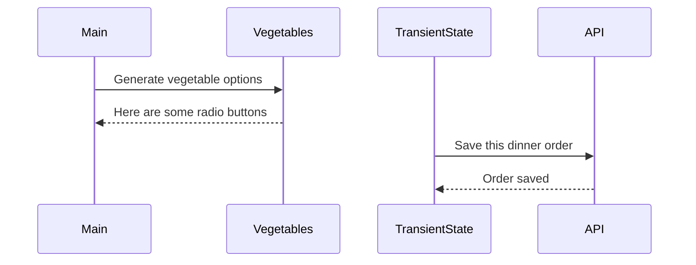

# Events and State Self-Assessment

> 🧨 Make sure you answer the vocabulary and understanding questions at the end of this document before notifying your coaches that you are done with the project

## Setup

1. Make sure you are in your `workspace` directory
1. `git clone {github repo SSH string}`
1. `cd` into the directory it creates
1. `code .` to open the project code
1. Use the `serve` command to start the web server
1. Open the URL provided in Chrome

## Requirements

### Initial Render

1. All 10 base dishes should be displayed as radio input options.
1. All 9 vegetables should be displayed as radio input options.
1. All 6 side dishes should be displayed as radio input options.
1. All previously purchases meals should be displayed below the meal options. Each purchase should display the primary key and the total cost of the purcahsed meal.

### State Management

1. When the user selects an item in any of the three columns, the choice should be stored as transient state.
1. When a user makes a choice for all three kinds of food, and then clicks the "Purchase Combo" button, a new sales object should be...
    1. Stored as permanent state in your local API.
    1. Represented as HTML below the **Monthly Sales** header in the following format **_exactly_**. Your output will not have zeroes, but the actual amount.
        ```html
        Receipt #1 = $00.00
        ```
   1. The user's choices should be cleared from transient state once the purchase is made.

## Design

Given the description and animation above...

1. Create an ERD for this application before you begin.
1. Make a list of what modules need to be created to make your application as modular as possible. Create a **Dependency Graph** for the project to be reviewed once you are complete with the assessment.
1. Create a **Sequence Diagram** that visualizes what your algorithm is for this project. We'll give you a minimal starting point.



## Vocabulary and Understanding

> 🧨 Before you click the "Assessment Complete" button on the Learning Platform, add your answers below for each question and make a commit. It is your option to request a face-to-face meeting with a coach for a vocabulary review.

1. Should transient state be represented in a database diagram? Why, or why not?
   > No. The database diagram is a way to visualize the database tables. While transient state stores data in memory and eventually sends that data to the database, the transient state is a temporary representation of the data and it then clears. The database diagram needs to represent the permanent state of the app's data.
2. In the **FoodTruck** module, you are **await**ing the invocation of all of the component functions _(e.g. sales, veggie options, etc.)_. Why must you use the `await` keyword there? Explain what happens if you remove it.
   > I have to use `await` keyword because I'm waiting on a promise to be fulfilled for those component functions. The component functions each are asynchronously fetching data from the API and that data isn't available instantaneously. So we use `await` while we wait on the data. Once the data is received, it then needs to be unpacked / parsed so I can turn it into a format I can work with. 
   >
   > Removing await will display `[object Promise]` on the page instead of the rendered HTML we expect. That's because the promise of the asynchronous component data hasn't yet been fulfilled. JS can only handle one thing at a time.
3. When the user is making choices by selecting radio buttons, explain how that data is retained so that the **Purchase Combo** button works correctly.
   > The user's choices are stored in browser memory in the temporary transient state. Then, when the user clicks the **Purchase Combo** button, the temporary transient data is sent through an API POST request as a JSON object to the database's `purchases` array and becomes permanent data.
4. You used the `map()` array method in the self assessment _(at least, you should have since it is a learning objective)_. Explain why that function is helpful as a replacement for a `for..of` loop.
   > We can still use `for..of` loops to convert an array of object strings into a single string. But the `map()` array method is a helpful replacement because it invokes a callback function that I define. That callback function is returning a string that is added to a new array without altering the original array. As it iterates through each element of the original array, it converts each object to a string and adds it into the new array. That is exactly what we need when building up an HTML string to represent a list of food options or a list of sales.
